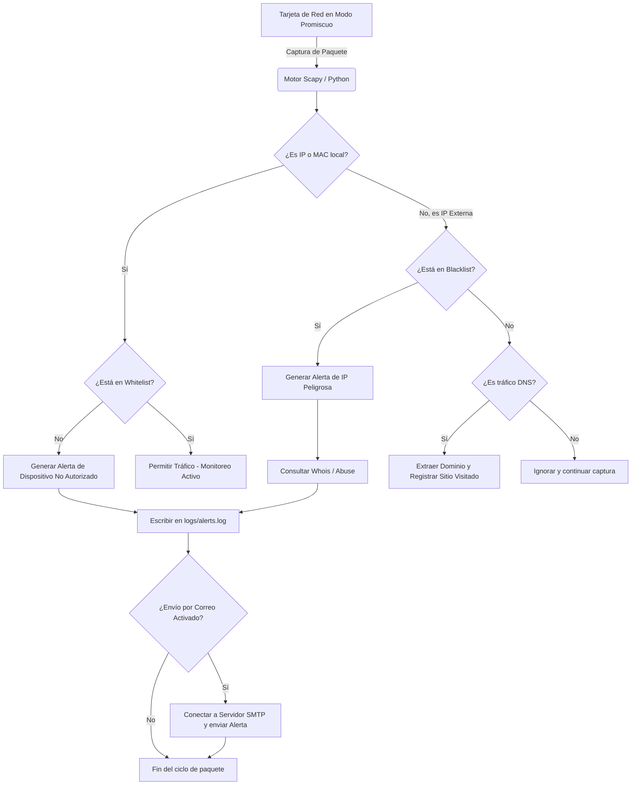

# Documentación Segura, Prerrequisitos y Análisis Jurídico

Este documento proporciona la especificación técnica de la arquitectura del IDS Institucional, demuestra las prácticas de codificación segura para la protección de credenciales y establece el marco legal aplicable al monitoreo de red en un entorno institucional bajo la legislación mexicana.

---

## 1. Arquitectura y Modelo OSI

El sistema opera interceptando tráfico de red para analizar metadatos y correlacionarlos con listas de control de acceso. El flujo de trabajo del sistema interactúa con múltiples capas del Modelo OSI:
- **Capa 2 (Enlace de Datos):** Extrae y evalúa las direcciones MAC físicas para la Lista Blanca.
- **Capa 3 (Red):** Extrae direcciones IP origen y destino para verificar permisos de red y detectar conexiones a IPs maliciosas (Blacklist).
- **Capa 7 (Aplicación):** Inspecciona consultas DNS para generar reportes de sitios visitados y utiliza el protocolo SMTP para el envío de alertas.

### Diagrama de Flujo del Sistema

A continuación, se presenta el diagrama de flujo lógico de la captura y análisis de paquetes del IDS:



---

## 2. Protección de Credenciales

Para cumplir con los más altos estándares de seguridad de la información y prevenir la fuga de datos sensibles, **el código fuente del IDS no contiene contraseñas en texto plano (hardcoded)**. 

### Implementación del archivo `.env`
El sistema utiliza la biblioteca `python-dotenv` para cargar variables de entorno en tiempo de ejecución. Toda información confidencial se almacena en el archivo local `config/.env`, el cual está explícitamente excluido del control de versiones mediante el archivo `.gitignore`.

**Muestra del código que asegura esta implementación (`src/config_loader.py`):**
```python
from dotenv import load_dotenv
import os

# El sistema carga las variables desde el archivo .env, nunca desde el código duro.
load_dotenv('config/.env')

SMTP_PASSWORD = os.getenv('SMTP_PASSWORD')
VIRUSTOTAL_API_KEY = os.getenv('VIRUSTOTAL_API_KEY')
```

**Ventajas de seguridad obtenidas:**
1. **Evita la exposición:** Si un atacante o auditor obtiene el código fuente mediante herramientas automatizadas (e.g., *HTTrack* a un repositorio expuesto) o accede a un clon del repositorio, no tendrá acceso a la contraseña del correo SMTP ni a las API Keys.
2. **Encriptación en tránsito:** La conexión con el servidor SMTP utilizará STARTTLS o SSL implícito, garantizando que, aunque la contraseña se lea localmente desde el archivo `.env`, viaje cifrada por la red.

*Nota técnica:* Para maximizar la seguridad en servidores Linux de producción, se recomienda que el archivo `config/.env` posea permisos restrictivos (`chmod 600 config/.env`) para que únicamente el usuario que ejecuta el script pueda leerlo.

---

## 3. Análisis Jurídico del Monitoreo (Legislación Mexicana)

El uso de un IDS (Sistema de Detección de Intrusos) en una red corporativa o académica en México requiere un sustento legal, ya que el monitoreo de redes puede entrar en conflicto con los derechos a la privacidad e inviolabilidad de las comunicaciones privadas.

### 3.1 Marco Legal Aplicable

1. **Constitución Política de los Estados Unidos Mexicanos (CPEUM) - Artículo 16:**
   Consagra el derecho a la inviolabilidad de las comunicaciones privadas. Para que el monitoreo institucional sea legal, debe existir un **consentimiento previo** de las partes (los usuarios) a través de una normativa interna que advierta que el uso de la infraestructura tecnológica de la institución está sujeta a revisión por motivos de seguridad.

2. **Ley Federal de Protección de Datos Personales en Posesión de Particulares (LFPDPPP):**
   Determina cómo deben ser tratados los datos que identifiquen o hagan identificable a una persona.
   - **¿El IDS recolecta Datos Personales?** Sí. En algunos contextos jurídicos (como el europeo GDPR y resoluciones del INAI en México), las Direcciones IP dinámicas o estáticas, así como las Direcciones MAC de equipos personales (BYOD), pueden considerarse datos personales, ya que permiten identificar a un usuario específico cuando se cruzan con registros de la red.
   - Sin embargo, **el IDS NO captura contraseñas, contenido de correos (payloads) ni información personal sensible**. Solo captura metadatos (IP, MAC, DNS, Timestamp) necesarios estrictamente para salvaguardar la seguridad de la información.

### 3.2 Política de Uso y Aviso de Privacidad Interno

Debido a lo anterior, es mandatorio que toda institución que despliegue este IDS publique o incluya en su reglamento interno la siguiente política o "Aviso de Privacidad simplificado", asegurando el cumplimiento de la LFPDPPP:

> **POLÍTICA DE MONITOREO Y AVISO DE PRIVACIDAD PARA USO DE LA RED INSTITUCIONAL**
> 
> *Con fundamento en la Ley Federal de Protección de Datos Personales en Posesión de los Particulares (LFPDPPP), se le informa a todo usuario, alumno o empleado que haga uso de la infraestructura de red (cableada o inalámbrica) de esta institución, que el tráfico de datos será monitoreado continuamente por Sistemas de Detección de Intrusos (IDS).*
> 
> *1. **Finalidad:** Los datos recolectados (Direcciones IP, direcciones MAC físicas y metadatos de dominios consultados) se utilizarán única y exclusivamente para fines de seguridad informática, prevención de fraudes, mitigación de ataques y control de acceso.*
> *2. **Naturaleza de los Datos:** No se interceptarán, almacenarán ni analizarán comunicaciones privadas, contraseñas, ni el contenido del tráfico encriptado de los usuarios.*
> *3. **Consentimiento:** El uso de la red institucional constituye su consentimiento expreso para dicho monitoreo bajo las condiciones aquí descritas, renunciando a cualquier expectativa de privacidad sobre los metadatos de conexión técnica.*
> *4. **Salvaguarda:** Las bitácoras (logs) generadas serán tratadas con estricta confidencialidad, almacenadas localmente de manera segura y no serán compartidas con terceros, salvo requerimiento expreso de una autoridad judicial mexicana competente.*

Esta política legitima la operación del IDS Institucional, protegiendo a la organización de demandas laborales o civiles por presunta violación a las comunicaciones y garantizando un tratamiento leal y lícito de los datos personales.
